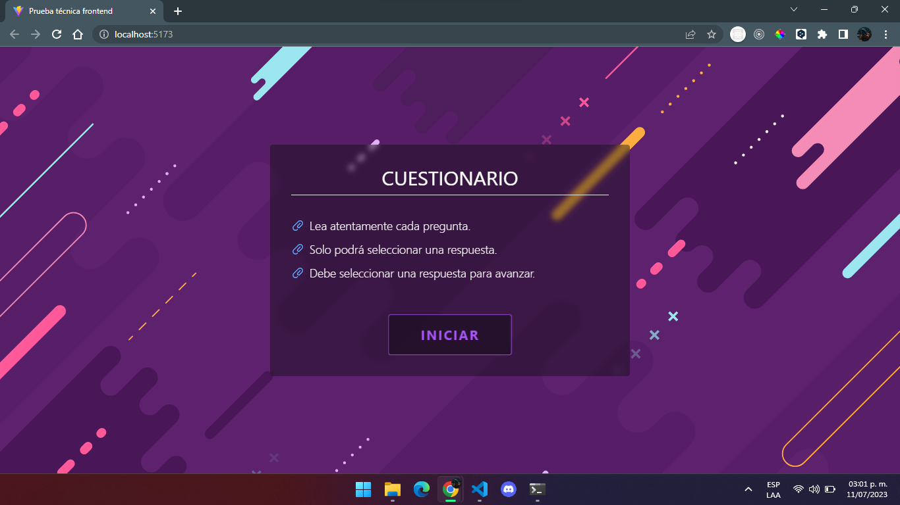
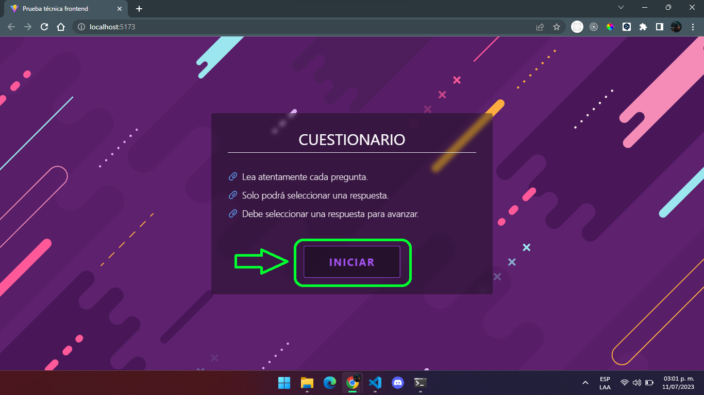
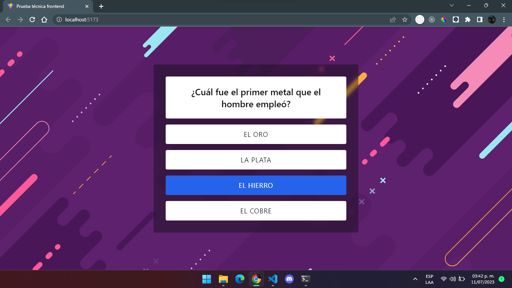
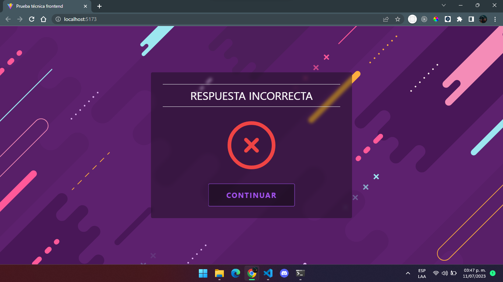

# Cuestionario Interactivo

Este proyecto representa un cuestionario interactivo de opción múltiple.

Permite mostrar a un usuario un cuestionario con una serie de preguntas, las
cuales se muestran una a la vez. EL usuario únicamente puede seleccionar una
sola respuesta de las opciones disponibles por cada respuesta. Al haber
seleccionado alguna respuesta se muestra un mensaje informativo, el cual indica
si la opción previamente elegida es la correcta o no, y además se muestra un
botón para avanzar a la siguiente pregunta. Al finalizar con todas las
preguntas, se muestra información sobre el total de preguntas y las preguntas
seleccionadas que fueron correctas, además de un sistema de puntajes y un botón
para reiniciar el ecuestionario.

## Comenzando 🚀

_Estas instrucciones te permitirán obtener una copia del proyecto en
funcionamiento en tu máquina local para propósitos de desarrollo y pruebas._

### Instalación 🔧

Pasos a seguir para tener un entorno de desarrollo ejecutandose Estos pasos debe
realizarlos usando un CLI

Clone el proyecto del repositorio remoto

```
git clone https://github.com/briansleonel/prueba-tecnica-frontend.git
```

Ingrese a la carpeta raíz del proyecto

```
cd prueba-tecnica-frontend
```

Levante el proyecto para ser ejecutado en local

```
npm run dev
```

Podrá ver el proyecto ejecutandose en local, en el puerto 5173:
[http://localhost:5173/](http://localhost:5173/)

Al ingresar al host, podrá ver lo siguiente:

<p align="center"></p>

## Testeo manual ⚙️

Testeo de la aplicación y su correcto funcionamiento.

### Iniciar el cuestionario

Para poder iniciar el cuestionario, el usuario deberá presionar el botón
_**INICIAR**_ que se encuentra en la vista principal de la aplicación. SI no se
presiona este botón, no se puede dar por empezado el cuestionario.

<p align="center"></p>

### Cuestionario en acción

Luego de inciado el cuestionario, se muestra una pregunta a la vez. El usuario
si o si debe responder la pregunta para poder pasar a la siguiente.

<p align="center"></p>

El usuario solo podrá seleccionar una opción. Al seleccionar la opción elegida,
el cuestionario automáticamente cierra esa ventana e informa sobre el estado de
la respuesta, es decir, si la opción elegida es correcta o incorrecta.

<p align="center"></p>

En ningún momento se podrá volver atrás una pregunta, simplemente avanzar hacia
adelante, a través del botón _**CONTINUAR**_ presentado luego de haber elegido
alguna opción.

Al finalizar con todas las preguntas, se mostrará el resultado. Se evaluó la
cantidad de preguntas totales que tiene el cuestionario y el total de preguntas
respondidas de forma correcta, y en base a estos datos se establece el puntaje
recibido. Y solo podes reiniciar el cuestionario de ser necesario, no volver
atrás a las preguntas.

<p align="center"></p>

## Construido con 🛠️

En este proyecto se usaron las siguientes bibliotecas:

-   [Heroicons](https://heroicons.com/) - Proveedor de iconos SVG - _Permitió
    usar iconos dentro de la aplicación para una mejor visualización de ciertas
    interacciones._
-   [Tailwind CSS](https://tailwindcss.com/) - Framework de CSS - _Se usó para
    mejorar la apariencia visual de la aplicación, proporcionando una interfaz
    de usuario más estética y agradable visualmente._
-   [Animated Tailwind CSS](https://brc-dd.github.io/animated-tailwindcss/) -
    Animaciones de Tailwind CSS - _Permitió agregar animaciones en la
    visualización de ciertos componentes, permitiendo mejorar la interactividad
    dentro de la aplicación._

## Autores ✒️

-   **González Brian Leonel** - _Desarrollador_ -
    [briansleonel](https://github.com/briansleonel)
